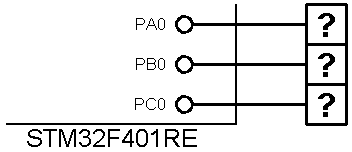

## Peripheral Clock/Reset 
Understand Peripheral Clock/Reset configuration on STM32F401 and compare abstraction layers. 

### Simulate  
  

### Features
- **MCU:** STM32F401RET6

### Folders and Files
- `BareMetal` (Exercises using CMSIS)
- `HAL` (Exercises using HAL drivers)
- `LL` (Exercise using LL Drivers)
- `Simulate` (Simulation file)

Note: The simulation doesn't work for this exercise.   

### Useful Links
GitHub Profile:  
[GitHub.com/AliRezaJoodi](https://github.com/AliRezaJoodi)   
Download single folder or file from GitHub:  
[https://minhaskamal.github.io/DownGit/#/home](https://minhaskamal.github.io/DownGit/#/home)  