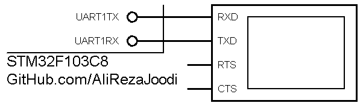

## CRC-32, STM32F103
Understand peripheral configuration and compare abstraction layers.  

### Simulate  
  

### Features
- **MCU:** STM32F103C8

### Folders and Files
- `BareMetal` (Exercises using CMSIS)
- `HAL` (Exercises using HAL drivers)
- `LL` (Exercise using LL drivers)
- `Simulate` (Simulation file)

Note:  
The CRC value displayed in the Proteus simulator is NOT correct. It does not match the result of the real STM32F103 hardware.  

### Useful Links
GitHub Profile:  
[GitHub.com/AliRezaJoodi](https://github.com/AliRezaJoodi)   
Download single folder or file from GitHub:  
[https://minhaskamal.github.io/DownGit/#/home](https://minhaskamal.github.io/DownGit/#/home)  