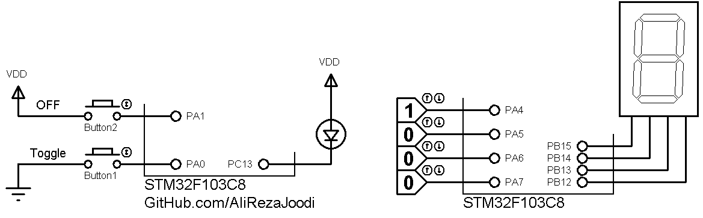

## Configure Input and Output with LL Drivers
              
MCU:     	STM32F103C8  
System Clock:	8MHz with HSI RC  

### Folder and Files Description
It has included:
- `Core` (User Code with C Language)
- `MDK-ARM` (IDE File for Keil uVision5)
- `Simulate` (Simulator File)
- `Main.ioc` (Code Generator with STM32CubeMX)

### Simulate: v1.0

My GitHub Account: [GitHub.com/AliRezaJoodi](https://github.com/AliRezaJoodi)  
**Note**: [You can go here to download a single folder or file from GitHub.com](https://minhaskamal.github.io/DownGit/#/home)
