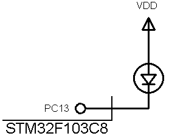

## Utility/TimeBase
Test my library from CrossPlatformLibraries.  

### Simulate  
  

### Features
- **MCU:** STM32F103C8
- **Default Framework:** LL driver from STM32Cube_FW_F1_V1.8.7
- **System Clock:** HSI (Internal RC), 8 MHz 
- **Debug Interface:** JTAG (4 Pins)

### Folders and Files
- `Core` (User Code with C Language)
- `CrossPlatformLibraries` (ignored in repository)
- `Drivers` (STM32Cube Firmware Drivers – ignored in repository)
- `MDK-ARM` (IDE File for Keil uVision5)
- `Main.ioc` (Code Generator with STM32CubeMX)
- `Simulate` (Simulation file)

Note:  
- The `Drivers` folders are not included in this repository to keep it lightweight. 
- The `CrossPlatformLibraries` folders are not included in this repository to keep it lightweight.  
Please refer to the main repository README for setup instructions. 

### Useful Links
GitHub Profile:  
[GitHub.com/AliRezaJoodi](https://github.com/AliRezaJoodi)   
Download single folder or file from GitHub:  
[https://minhaskamal.github.io/DownGit/#/home](https://minhaskamal.github.io/DownGit/#/home)  